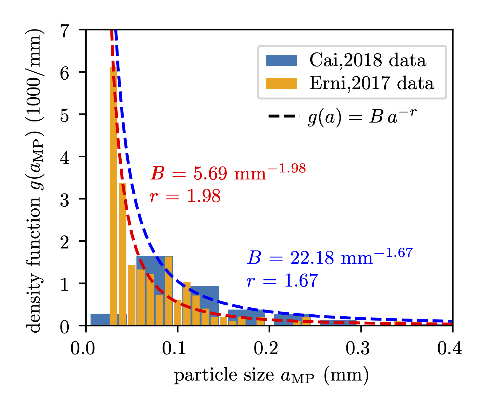

"Du 😋 jede Woche [:0,1 g bis 5 g](#paper) an Mikroplastik".

 

 

 

 

 

 

 

-----
Martin Pletz, Leoben, 2023-11.

<!-- ------ [:(alle links)](#links) ------------------------ -->

## :x paper

Das wird im Paper (Senathirayah et al. 2021) berechnet. Doch [:wie](#analyse)?

* K. Senathirajah, S. Attwood, G. Bhagwat, M. Carbery, S. Wilson, T. Palanisami, *Estimation of the mass of microplastics ingested – A pivotal first step towards human health risk assessment*, Journal of Hazardous Materials. 404 (2021) ([link](https://doi.org/10.1016/j.jhazmat.2020.124004))

## :x analyse

Als erstes schätzen sie ab, was Menschen an Wasser aus Flaschen (💧) und Bier (🍺) [:trinken](#sen-trinken) bzw. Salz (🧂) und Krustentiere (🦀) [:essen](#sen-essen). Dann suchten sie in der Literatur nach Arbeiten, die herausfanden, wie viele Mikroplastikpartikel pro Liter oder Kilogramm in 💧, 🍺, 🧂 und 🦀 enthalten ist and nach Arbeiten, aus denen sie die Größe und damit das Gewicht dieser Partikel abschätzten.

Dementsprechend nimmt man in der Woche 173 bis 3355 (💧), 3,4 bis 17 (🍺), 0,79 bis 2,1 (🧂) und 50 bis 312 (🦀) Partikel auf. [:Unabhängig](#problem-num-mass) von den Arbeiten, die Partikelzahlen bestimmt haben, schätzen [:drei Szenarios](#szenarios) schätzen sie das Partikelgewicht ab und kamen damit auf 5.5 g/Woche, 0.1 g/Woche und 0.3 g/Woche.

## :x problem-num-mass

Das ist aber ein Problem: umso genauer man hinschaut, umso mehr Partikel findet man. Für Wasser schaut das so aus:

Das ist natürlich ein großes Problem, wenn man bei den mittleren Partikelmassen nicht berücksichtigt, wie genau man bei den Partikelzahlen hingeschaut hat.

## :x sen-trinken

Wird in Senathirayah et al. 2021 nicht ganz klar, könnte 219 Liter Wasser aus Plastikflaschen und 6 Liter Bier (wobei sie sich auf eine [WHO Website](https://www.alcohol.org/guides/global-drinking-demographics/) und die Zahlen für Deutschland beziehen und vermutlich die Liter an reinem Alkohol (6) mit Litern an getrunkenem Bier verwechselt haben, die wohl eher bei [90 Litern](https://de.statista.com/statistik/daten/studie/4628/umfrage/entwicklung-des-bierverbrauchs-pro-kopf-in-deutschland-seit-2000/) pro Kopf und Jahr liegt) im Jahr sein

## :x sen-essen

Etwa 3,8 kg Salz und 20 kg Fisch im Jahr

## :x szenarios

1. Aus Studien, die Mikroplastik aus dem [:Meer](#meer) gefischt haben und sowohl Gesamtmassen als auch Gesamtpartikelanzahl [:angegeben haben](#szen-1): [:2.8 mg](#masse-szen-1) pro Partikel.
2. Aus Studien, die die [:Größenverteilung der Partikel](#groessenverteilung) gemessen haben und die Masse berechnet unter der Annahme, dass die Partikel [:kugelförmig](#kugelform) sind: 0.43 µg (💧), 0.48 mg (🍺), [:13 mg (🧂)](#salz) und 2.9 ng (🦀).  
3. Auch aus Größenverteilung der Partikel, doch die Partikel sind hier [:würfelförmig](#wuerfelform) angenommen, alle etwa 90% größere Masse als bei Szenario 2.

## :x salz
diese 13 mg entsprechen kugelförmigen Partikeln mit einem Durchmesser von 2,94 mm

## :x meer
ja, aus dem Meer! Wenn du dich fragst, warum die Partikel mit Meer genau so groß sein sollen wie die in unseren Nahrungsmitteln, dann hast du Recht.

## :x szen-1

da das Diagramm mit den Cox und anderen Arbeiten reintun und erklären...

## :x masse-szen-1

Unter der Annahme, dass das Partikel in Plastikflaschen sind und aus PET bestehen (Dichte von 1.4 g/cm3) kommt man damit auf einen Durchmesser von 1.56 mm. Was insofern interessant ist, als dass die angeblich für einen Größenbereich von 0-1 mm bestimmt wurden.

## :x groessenverteilung

da ein schönes Diagramm her tun und das erklären...

## :x kugelform
Was nicht besonders realistisch ist: Zum Beispiel [hier]() wird beschrieben, dass die meisten Partikel Fasern und Folien sind, die bei gleicher Größe sehr viel kleinere Massen aus Kugeln haben.

## :x wuerfelform
Was noch unrealistischer als die Kugelform ist: Würfelförmige Partikel kommen in Arbeiten, die sich mit den Partikelformen von Mikroplastik beschäftigen, überhaupt nicht vor.

<!-- ------------------------------------------------------ -->
